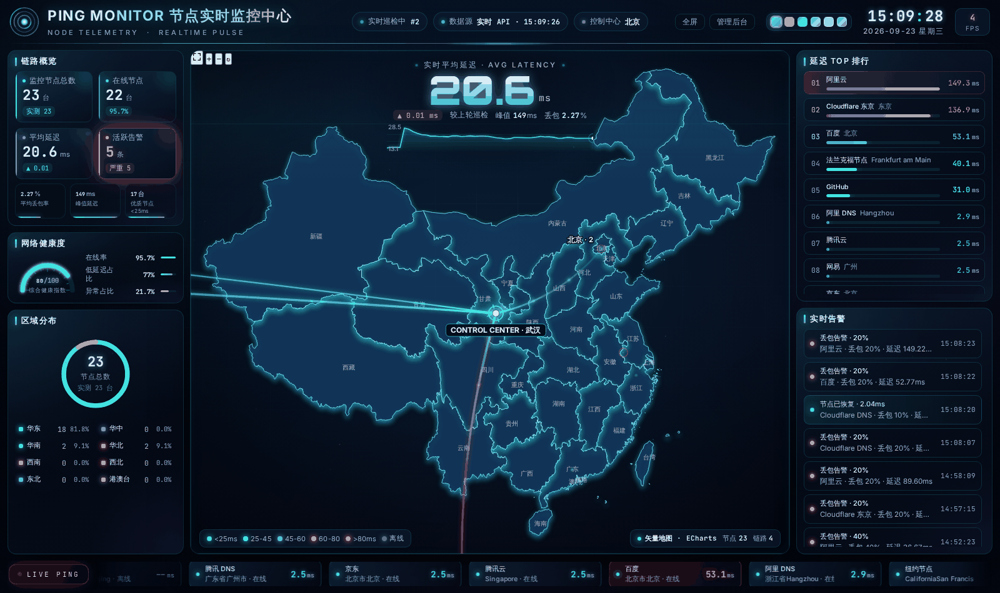
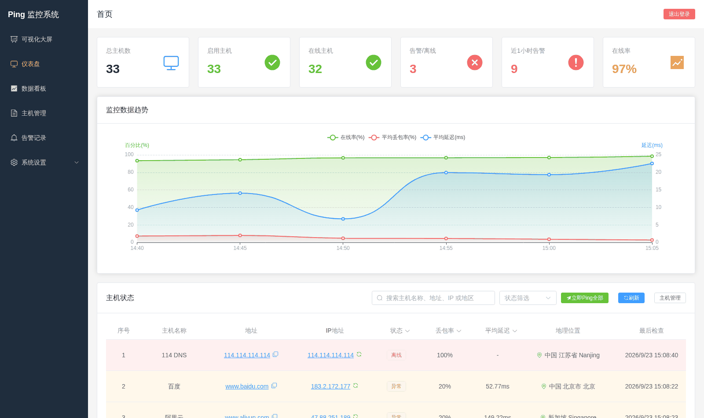
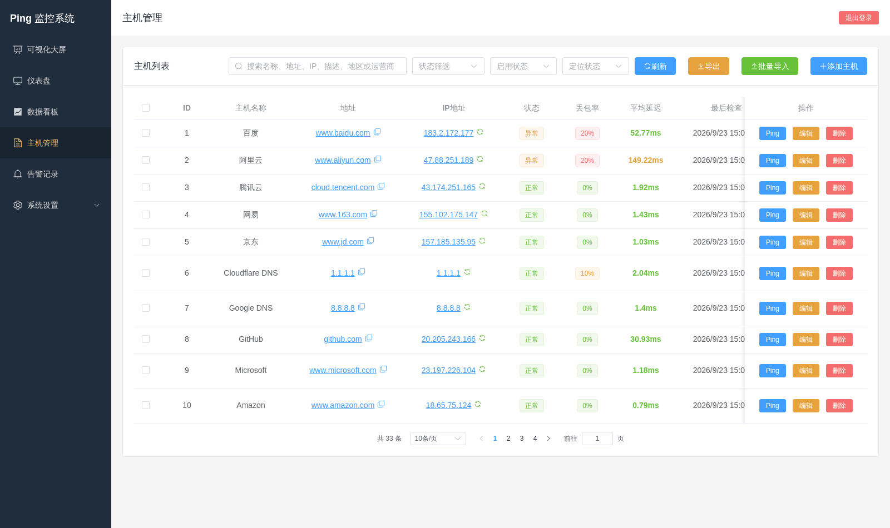
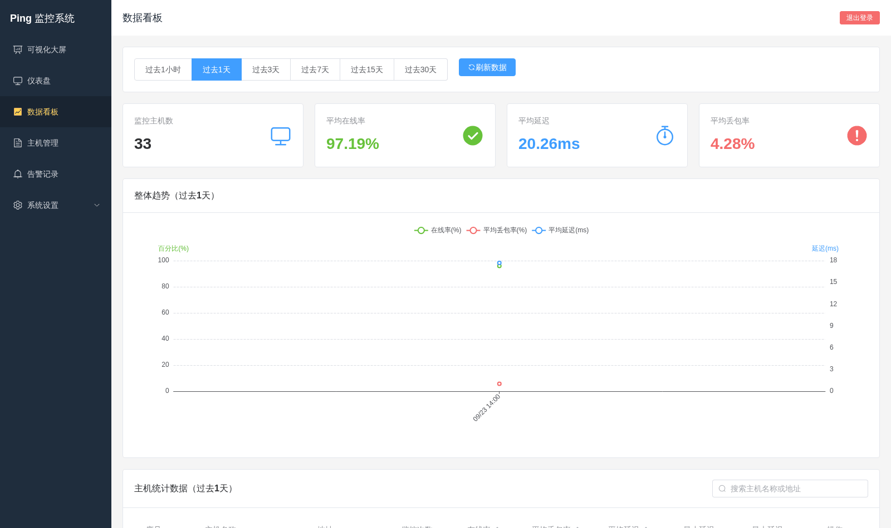
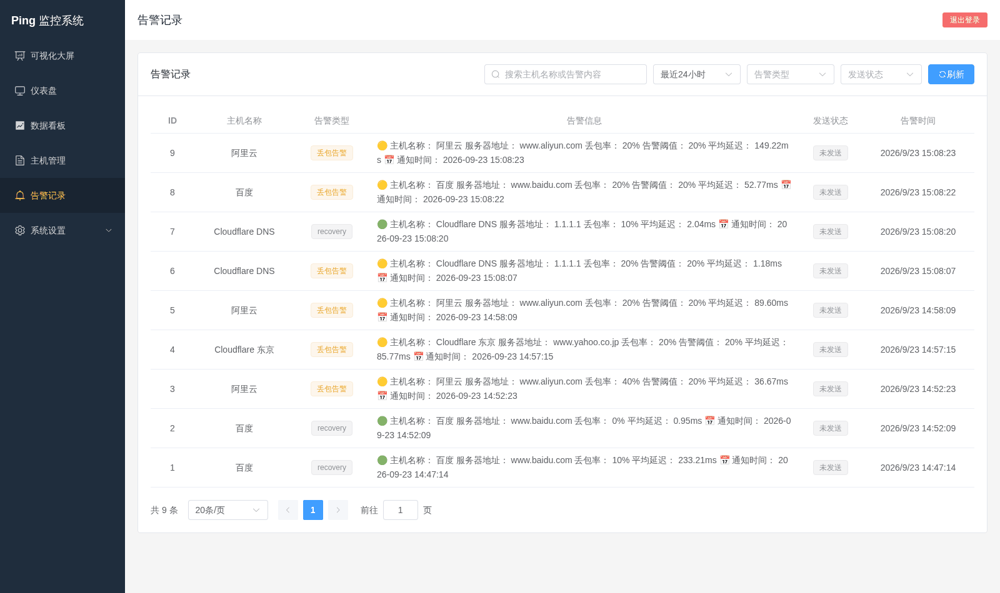

<div align="center">
  
  <h1>Ping Monitor</h1>
  <p>基于 FastAPI + Vue 3 + Element Plus + ECharts 的主机连通性监控系统</p>
  <p>支持 Ping 检测、告警通知、地理位置解析、可视化大屏、数据看板和 Docker 双架构部署。</p>
  <p>
    
    
    
    
    
  </p>
  <p>
    
    
    
    
  </p>
  <p>
    <a href="https://ping.774966.xyz"><b>🚀 在线演示</b></a>
    ·
    <a href="#快速开始">快速开始</a>
    ·
    <a href="#功能概览">功能概览</a>
    ·
    <a href="#docker-发布">Docker 发布</a>
    ·
    <a href="#更新日志">更新日志</a>
  </p>
  <p>
    <a href="https://github.com/JunWan666/ping-monitor/stargazers"></a>
    <a href="https://hub.docker.com/r/tannic666/ping-monitor"></a>
    
  </p>
</div>

---



<sub>可视化大屏 · 节点地域分布、实时延迟、区域染色、飞线链路、延迟 TOP 排行与实时告警</sub>

## 界面预览

| 管理后台 · 概览 | 主机管理 |
|:---:|:---:|
|  |  |

| 数据看板 | 告警记录 |
|:---:|:---:|
|  |  |

## 项目亮点

- 主机监控：支持单主机/批量主机监控，实时查看在线状态、延迟、丢包率。
- 数据看板：支持 `1h / 1d / 3d / 7d / 15d / 30d` 统计视图。
- 可视化大屏：支持中国/全球地图、区域染色、飞线、监控中心、全屏展示。
- 地理位置增强：支持域名解析、IP 定位、手动刷新位置、自动补全缺失位置。
- 告警通知：支持 Server 酱、钉钉机器人、报表通知。
- 后台体验优化：支持模糊搜索、状态筛选、分页、导入导出、系统日志筛选。
- 部署简单：支持本地启动、`docker compose` 启动、Docker Hub 双架构镜像部署。

## 技术栈

### 后端

- FastAPI
- SQLAlchemy
- APScheduler
- ping3
- Redis
- MySQL / SQLite

### 前端

- Vue 3
- Vue Router
- Element Plus
- ECharts
- Axios
- Vite

## 功能概览

### 监控与告警

- 支持主机新增、编辑、删除、启停监控。
- 支持立即 Ping、批量 Ping、流式 Ping。
- 支持按状态变化或持续异常发送告警。
- 支持告警记录分页、关键字搜索、类型筛选、发送状态筛选。

### 地理位置与主机管理

- 支持自动解析域名 IP。
- 支持导入/导出主机时携带地理位置信息。
- 支持缺失位置自动补全。
- 支持开启“自动刷新地理位置”后在监控过程中持续更新位置。
- 支持单主机手动刷新 IP、手动刷新地理位置。

### 可视化大屏

- 支持游客访问开关。
- 支持中国地图与全球地图切换。
- 支持地图拖拽、滚轮缩放、悬停详情、点击固定详情卡。
- 支持监控中心动态定位。
- 支持全屏展示、主题切换、飞线、区域状态染色。

### 系统管理

- 支持管理员初始化、登录、修改密码。
- 支持系统日志筛选与数据维护任务日志查看。
- 支持日报 / 周报 / 月报配置与发送。

## 目录结构

```text
ping-monitor/
├── backend/                    # FastAPI 后端
├── frontend/                   # Vue 前端
├── docker/                     # Docker 构建与编排文件
├── data/                       # 运行时数据目录
├── start.bat                   # Windows 本地启动脚本
├── migrate_db_docker.py        # Docker 数据迁移脚本
├── migrate_db_docker.sh        # Docker 数据迁移脚本
└── README.md
```

## 快速开始

### 方式一：直接使用 Docker Hub 镜像

已发布镜像：

- `tannic666/ping-monitor:latest`
- `tannic666/ping-monitor:v1.7.0`
- `tannic666/ping-monitor:v1.5.0`

镜像平台：

- `linux/amd64`
- `linux/arm64`

单容器模式默认使用 SQLite，本地数据保存在挂载目录中。

```bash
docker run -d \
  --name ping-monitor \
  -p 8000:8000 \
  -v "$(pwd)/data:/app/data" \
  -e TZ=Asia/Shanghai \
  --restart unless-stopped \
  tannic666/ping-monitor:latest
```

Windows PowerShell：

```powershell
docker run -d `
  --name ping-monitor `
  -p 8000:8000 `
  -v "$PWD/data:/app/data" `
  -e TZ=Asia/Shanghai `
  --restart unless-stopped `
  tannic666/ping-monitor:latest
```

访问地址：

- 系统首页：`http://localhost:8000`
- OpenAPI 文档：`http://localhost:8000/docs`

### 方式二：使用 docker compose

适合需要 `MySQL + Redis` 的完整部署方式。

```bash
docker compose -f docker/docker-compose.yml up -d
```

重新构建：

```bash
docker compose -f docker/docker-compose.yml up -d --build
```

如果要使用预构建镜像，可先设置环境变量：

```bash
export PING_MONITOR_IMAGE=tannic666/ping-monitor:v1.7.0
docker compose -f docker/docker-compose.yml up -d
```

Windows PowerShell：

```powershell
$env:PING_MONITOR_IMAGE="tannic666/ping-monitor:v1.7.0"
docker compose -f docker/docker-compose.yml up -d
```

### 方式三：本地开发

#### 后端

```bash
cd backend
pip install -r requirements.txt
python main.py
```

#### 前端

```bash
cd frontend
npm install
npm run dev
```

开发环境访问地址：

- 前端：`http://localhost:5173`
- 后端：`http://localhost:8000`
- API 文档：`http://localhost:8000/docs`

## 相关文档

- Debian 11 Docker 部署教程：`docs/DEPLOYMENT_DOCKER_DEBIAN11.md`
- MySQL + Redis 部署说明：`docs/DEPLOYMENT_MYSQL_REDIS.md`
- 一键部署脚本：`scripts/deploy-docker-debian11.sh`

## 环境变量

常用环境变量如下：

| 变量名 | 说明 | 默认值 |
| --- | --- | --- |
| `TZ` | 容器时区 | `Asia/Shanghai` |
| `DATABASE_URL` | 数据库连接地址 | 默认 SQLite |
| `REDIS_URL` | Redis 连接地址 | 空 |
| `ENABLE_CACHE` | 是否启用缓存 | `true` |
| `JWT_SECRET_KEY` | JWT 密钥 | 内置默认值 |
| `CACHE_TTL_DASHBOARD` | 仪表盘缓存秒数 | `15` |
| `CACHE_TTL_DATABOARD` | 数据看板缓存秒数 | `45` |
| `CACHE_TTL_HOST_DETAIL` | 主机详情缓存秒数 | `30` |
| `DISABLE_NOTIFICATIONS` | 禁用所有通知发送，适合本地复刻线上数据 | `false` |
| `DISABLE_SCHEDULER` | 禁用后台定时监控与维护任务，适合本地调试 | `false` |

项目根目录可通过 `.env` 管理本地启动参数。

### 本地复刻线上数据

仓库提供了本地同步脚本，方便把线上 MySQL 数据导入本地复刻问题；脚本会自动清空本地通知配置，并写入 `DISABLE_NOTIFICATIONS=true`、`DISABLE_SCHEDULER=true`，避免本地调试时误发钉钉或报表通知。

```powershell
powershell -ExecutionPolicy Bypass -File .\scripts\sync-prod-to-local.ps1
```

## 使用说明

### 首次访问

- 如未初始化管理员，系统会引导进入初始化页面。
- 初始化完成后使用管理员账号登录后台。
- 如果开启了可视化大屏公开访问，访问 `8000` 根路径会直接进入大屏。
- 如果关闭了公开访问，访问 `8000` 根路径会进入登录界面。

### 主机导入导出

- 导入时支持主机名称、地址、描述、告警阈值及地理位置信息。
- 导出时会带出当前主机定位结果。
- 若导入缺失地理位置，系统可按策略自动补全。

### 地理位置策略

- 关闭自动刷新时：已有位置不反复覆盖，缺失位置会自动补齐。
- 开启自动刷新时：监控过程中会尝试持续刷新位置信息。
- 支持后台手动刷新单个主机的 IP 和地理位置。

## API 概览

### 认证

- `POST /api/auth/init`
- `POST /api/auth/login`
- `GET /api/auth/me`
- `PUT /api/auth/update-password`

### 主机管理

- `GET /api/hosts`
- `POST /api/hosts`
- `PUT /api/hosts/{id}`
- `DELETE /api/hosts/{id}`
- `POST /api/hosts/{id}/refresh-ip`
- `POST /api/hosts/{id}/refresh-location`

### 监控与日志

- `POST /api/ping/{id}`
- `GET /api/ping-stream/{id}`
- `POST /api/ping-all`
- `GET /api/ping/logs`
- `GET /api/alerts`
- `GET /api/system-logs`

### 数据看板与大屏

- `GET /api/dashboard`
- `GET /api/databoard/stats/{timeRange}`
- `GET /api/databoard/host/{hostId}/{timeRange}`
- `GET /api/public/datascreen/status`
- `GET /api/public/datascreen`
- `GET /api/public/alerts`
- `GET /api/datascreen/config`
- `PUT /api/datascreen/config`

## Docker 发布

当前版本提供双架构镜像构建方式：

```bash
docker buildx build \
  --platform linux/amd64,linux/arm64 \
  -f docker/Dockerfile \
  -t tannic666/ping-monitor:v1.7.0 \
  -t tannic666/ping-monitor:latest \
  --provenance=false \
  --sbom=false \
  --push \
  .
```

## 更新日志

### v1.7.0 (2026-09-23)

- 大屏通用化：移除生产环境敏感信息与第三方品牌标识，控制中心按节点重心自动计算。
- 节点数据加载路径修正，示例数据与文案不再出现真实服务域名。
- PC 端交互补齐（鼠标拖拽 / 双击放大），移动端底部导航改固定定位，地图支持拖动平移。
- 修复内置矢量引擎地图左右镜像、刷新闪烁、滚轮缩放与高德视野重置问题。
- 新增 GitHub Actions 自动构建 `linux/amd64` / `linux/arm64` 双架构镜像。
- 文档：新增在线演示入口与界面截图。

### v1.6.0 (2026-05-18)

- 发布 `tannic666/ping-monitor:v1.7.0` 双架构镜像，支持 `linux/amd64` 与 `linux/arm64`。
- 仪表盘与主机管理改为优先读取 `hosts` 表上的最新 Ping 指标，避免每次从百万级明细表回查最新记录。
- Ping 写入链路同步维护 `last_packet_loss`、`last_avg_rtt`、`last_check`，旧库启动时会自动回填历史最新状态。
- 数据看板在命中 `ping_statistics` 聚合数据后不再额外回扫原始 `ping_records`，大幅降低 1d/7d 等统计接口耗时。
- 新增 `ping_records(host_id, id)` 复合索引，优化旧数据回填和最新记录兜底查询。
- 新增 `DISABLE_NOTIFICATIONS` 与 `DISABLE_SCHEDULER` 本地安全开关，方便复刻线上数据时禁用钉钉通知和定时任务。
- 新增 `scripts/sync-prod-to-local.ps1`，支持一键导出线上 MySQL 数据、导入本地并清空本地通知配置。
- Docker Compose 默认补充本地安全开关透传，并收紧 MySQL/Redis 本地端口绑定配置。

### v1.5.0 (2026-04-22)

- 新增可视化大屏配置页、游客访问开关、全屏按钮与预览入口。
- 重构可视化大屏，支持中国/全球地图、监控中心、区域染色、飞线、悬停与固定详情。
- 新增监控中心公网 IP 自动识别与动态定位。
- 新增 `ip_location_service`，优化国内 IP 定位结果，优先整合百度 Qifu 等数据源。
- 支持主机地理位置自动补全、自动刷新策略、手动刷新 IP/位置。
- 主机导入导出增强，兼容地理位置字段。
- 仪表盘、主机管理、告警记录、系统日志补充搜索、筛选与操作入口。
- 优化钉钉报表配置布局与后台整体交互体验。
- 修复菜单切换偶发白屏，为异步模块加载增加自动重试与刷新兜底。
- 保持 Docker 镜像支持 `linux/amd64` 与 `linux/arm64` 双架构发布。

### v1.4.0

- 自动数据库结构同步。
- 仪表盘数据点配置增强。
- 数据维护与日志展示优化。

### v1.3.0

- 新增数据看板。
- 新增系统日志与数据维护任务。
- 新增通知配置与维护配置优化。

### v1.2.0

- 通知模板重构。
- 支持修改密码。
- 导入导出与筛选体验优化。

### v1.1.0

- 新增 JWT 登录认证。
- 新增管理员初始化流程。

### v1.0.0

- 首个可用版本发布。

## 许可证

Apache-2.0 License

---

<div align="center">

**如果这个项目对你有帮助，欢迎点个 ⭐ Star 支持一下～**

[](https://star-history.com/#JunWan666/ping-monitor&Date)

</div>
